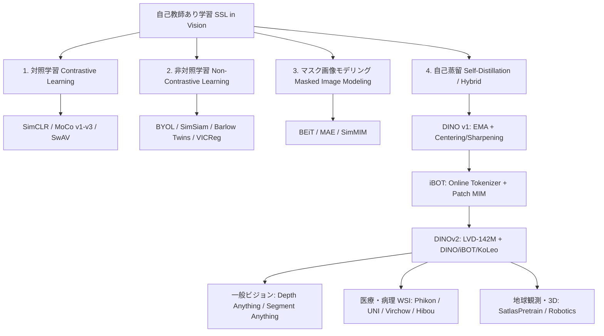
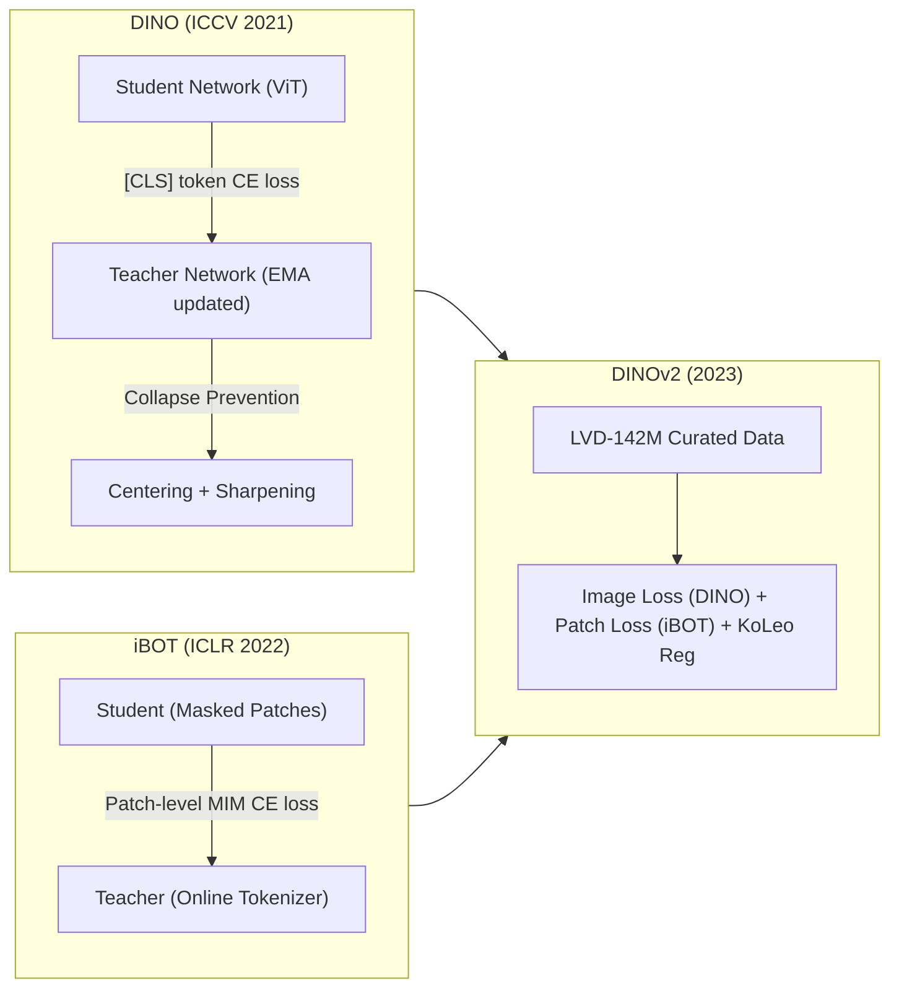
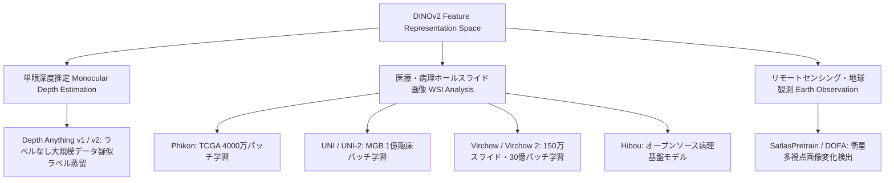

# 自己教師あり学習（SSL）モデルの歴史・アーキテクチャの変遷とDINOシリーズの深層分析およびドメイン応用

> **体系的サーベイ・技術総合調査レポート**  
> **プロジェクト**: `search-ssl`  
> **テーマ**: 自己教師あり画像表現学習（SSL: Self-Supervised Learning）の歴史、対照学習・非対照学習・MIM・自己蒸留のアーキテクチャ比較、および **DINO (Caron et al., 2021) / iBOT / DINOv2** の理論・実装詳述と多領域（一般ビジョン・医療病理・地球観測）応用事例

---

## エグゼクティブ・サマリー

コンピュータービジョン（CV）分野における **自己教師あり学習 (Self-Supervised Learning: SSL)** は、人手による高コストなアノテーション（ラベル）に依存せずに、大量の未ラベル画像データから頑健で高い汎用性を持つ視覚表現を獲得する技術として、過去5年間で劇的な進化を遂げた。自然言語処理（NLP）における Transformer と事前学習基盤モデル（BERT, GPT等）の革命に続き、CV分野でも SSL は単なる「事前学習の選択肢」から「視覚基盤モデル (Vision Foundation Models) 構築における不可欠な根底技術」へシフトしている。

本レポートでは、SSLの進化を **4つの系譜（対照学習、非対照学習/情報量最大化、マスク画像モデリング、自己蒸留）** に分類して体系化し、各アーキテクチャの課題設定、損失関数の数理設計、コラプス（表現崩壊）回避のメカニズムを比較解説する。さらに、現在の CV 基盤モデルの事実上の標準（デファクトスタンダード）となった Meta Research の **DINO シリーズ (DINO, iBOT, DINOv2)** について徹底解剖を行い、教師なしでの **「創発的セグメンテーション能力」** の原理、パッチレベル表現と大域表現の統合、そして 1.42億枚の自動キュレーションデータセット **LVD-142M** とスケーリングレシピを詳述する。最後に、単眼深度推定 (Depth Anything)、医療・病理画像解析 (Phikon, UNI, Virchow)、リモートセンシング等の各実応用への展開を実例に基づいて解説する。

---

---

## 第1章：コンピュータービジョンにおけるSSLモデルの歴史と4大アーキテクチャの変遷

自己教師あり学習（SSL）の本質的課題は、**「ラベルのシグナルがない状態でいかにしてモデルが有意義なセマンティック特徴量を学習し、かつすべての出力が同一定数へ縮退してしまう『表現の崩壊 (Representation Collapse / Trivial Solution)』を防止するか」** という点に集約される。これにアプローチする手法は以下の4つのパラダイムへ変遷・発展してきた。

### 1.1 対照学習 (Contrastive Learning)
対照学習は、同一画像の異なるデータ拡張（クロップ、色歪み、ぼかし等）を施したペアを **正例 (Positive Pair)**、バッチ内あるいは辞書内の別の画像から生成されたサンプルを **負例 (Negative Pair)** とみなし、表現空間上で「正例を近づけ、負例を遠ざける」目的関数を最適化する。

- **SimCLR (Chen et al., ICML 2020)**:  
  シンプルかつ強力な対照学習フレームワーク。特徴抽出器 $f(\cdot)$ の出力に非線形射影ヘッド (MLP Projection Head) $g(\cdot)$ を導入し、温度係数 $\tau$ 付きの正規化交差エントロピー損失 (**NT-Xent Loss**) を最小化する。
  $$L_{i,j} = -\log \frac{\exp(\text{sim}(z_i, z_j)/\tau)}{\sum_{k=1}^{2N} \mathbb{I}_{[k \neq i]} \exp(\text{sim}(z_i, z_k)/\tau)}$$
  SimCLRは強力な空間的クロップと色歪み (Color Jittering) の組み合わせが必須であることを実証したが、精度を出すためには極めて大きなバッチサイズ（例: 4096）を必要とした。

- **MoCo (He et al., CVPR 2020 / Chen et al., 2020, 2021)**:  
  対照学習を「辞書検索問題」として再定義。バッチサイズへの依存を解消するために **ダイナミックキュー (Dynamic Queue)** に過去のエンコード結果を維持し、キュー内の負例を一貫した表現空間にするために **モメンタムエンコーダー (Momentum Encoder)** を導入した。
  $$\theta_k \leftarrow m \theta_k + (1-m)\theta_q, \quad m \in [0.99, 0.9999]$$
  MoCo v2 では SimCLR の MLP ヘッドと拡張を統合し、MoCo v3 では Vision Transformer (ViT) に適用した際の勾配スパイクと学習不安定性を分析した。

- **SwAV (Caron et al., NeurIPS 2020)**:  
  ペアごとの明示的な比較に代わって、オンラインでのクラスタプロトタイプ（球状コードブック）への割り当てコードの整合性を学習。Sinkhorn-Knopp アルゴリズムに基づくオンライン割り当てと **Multi-crop 戦略**（高解像度クロップ2枚と低解像度クロップ複数枚）の導入により計算効率を高めた。

> [!WARNING]
> **対照学習の課題と限界**:  
> 大量の負例サンプルを正しく機能させるには大規模バッチや複雑なキュー管理が必要であるうえ、「偶発的に意味が類似している別の画像」まで負例として突き放してしまう **False Negatives（偽負例）問題** がセマンティック表現の天井を制限する要因となっていた。

---

### 1.2 非対照学習 (Non-Contrastive Learning / Information Maximization)
対照学習が抱える負例依存問題から脱却するため、**負例を一切使用せずに正例ペアの一貫性のみを学習する** 非対照学習パラダイムが2020～2021年に登場した。

- **BYOL (Grill et al., NeurIPS 2020)**:  
  オンラインモデルとターゲットモデル（EMA更新）の構造において、オンライン側にのみ追加の予測器 (Predictor $q_\theta$) を配置する **非対称アーキテクチャ** を導入。負例なしでも表現崩壊が起きず、強力な特徴表現を獲得した。
- **SimSiam (Chen & He, CVPR 2021)**:  
  モメンタムエンコーダーすら除外し、**Stop-Gradient 演算** のみがコラプスを防ぐ本質的要素であることを解明。二つのビュー $x_1, x_2$ に対する損失関数を以下の対称な形で定式化した。  
  $$L = \frac{1}{2} D(p_1, \text{stop\\_grad}(z_2)) + \frac{1}{2} D(p_2, \text{stop\\_grad}(z_1))$$
- **Barlow Twins (Zbontar et al., ICML 2021) & VICReg (Bardes et al., ICLR 2022)**:  
  情報量最大化および冗長性削減のアプローチ。Barlow Twins は特徴空間におけるペアごとの相互相関行列を単位行列 $I$ に近づける損失を課し、VICReg は特徴量の **分散 (Variance)** を維持し、ペア間の **不変性 (Invariance)** を高め、異なる次元間の **共分散 (Covariance)** を脱相関させる3項構成により、あらゆるネットワーク構造に対してコラプスしない安定性を保証した。

---

### 1.3 マスク画像モデリング (Masked Image Modeling - MIM)
自然言語処理における BERT (Devlin et al., 2019) の成功をビジョン分野に輸入したパラダイム。画像を入力パッチ配列に分割し、その一部をランダムにマスク（隠蔽）した上で、見えている周囲のパッチからマスク部分の内容を再構成・予測させる。

| モデル名 | 発表年 | トークナイザー/ターゲット | マスク率 | アーキテクチャ特徴 | 主な強み |
| :--- | :--- | :--- | :--- | :--- | :--- |
| **BEiT** | ICLR 2022 | 離散変分オートエンコーダ (dVAE) | 約40% | パッチを8192語の離散ビジュアルトークンに変換し分類 | NLPのMLMを厳密に踏襲。高精度な表現 |
| **MAE** | CVPR 2022 | 生の画素値 (Pixel L2 再構成) | **75%** | 可視パッチのみをEncoderに通し、Decoderで復元 | 超高速な事前学習、微細なローカル空間情報の保持 |
| **SimMIM** | CVPR 2022 | 生の画素値 (Pixel L1 再構成) | 約50-75% | 特殊なデコーダを使用せず線形射影のみで再構成 | 極めてシンプルな構成でのスケーリング |

> [!NOTE]
> **MIMと対照/非対照学習の表現の質の違い**:  
> MIM（特に対照学習を使わないMAEなど）は、空間的・幾何学的な細部のテクスチャ表現（ローカルな特徴）を極めて正確に保持するため、物体検出やピクセル単位のセグメンテーションでのファインチューニングに強い。一方で、$k$-NNや線形分類（リニアプローブ）など、画像全体の大域的なセマンティック分類能力に関しては、対照学習や自己蒸留手法に劣る傾向があることが明らかになっていた。

---

## 第2章：DINOシリーズの深層アーキテクチャ分析（DINO, iBOT, DINOv2）

対照学習や MIM が持つ長所・短所を統合・昇華し、現在世界で最も成功した自己教師あり視覚基盤となっているのが、Meta Research により開発された **DINO (Caron et al., ICCV 2021)**、並びにその拡張である **iBOT (Zhou et al., ICLR 2022)** および **DINOv2 (Oquab et al., 2023)** である。

---

### 2.1 DINO (Emerging Properties in Self-Supervised Vision Transformers)
DINO (**Self-DIstillation with NO labels**) は、Vision Transformer (ViT) に適した自己蒸留に基づく SSL フレームワークとして提案された。

#### 1. アーキテクチャと自己蒸留メカニズム
生徒モデル $g_{\theta_s}$ の出力確率分布 $P_s$ と、教師モデル $g_{\theta_t}$ の出力確率分布 $P_t$ の交差エントロピー損失を最小化する。教師パラメータ $\theta_t$ は勾配逆伝播で学習せず、生徒パラメータの指数移動平均 (EMA) によって滑らかに更新される。
$$\theta_t \leftarrow \lambda \theta_t + (1 - \lambda)\theta_s$$
入力画像に対して Multi-crop 戦略を適用し、2枚の大域的クロップ $x_1^g, x_2^g$ と、複数枚の局所的クロップ $x^l$ のセット $V$ を生成する。生徒モデルは全てのクロップを受容するが、**教師モデルは大域的クロップのみを受容**する。
$$\min_{\theta_s} \sum_{x \in \{x_1^g, x_2^g\}} \sum_{x' \in V, x' \neq x} H(P_t(x), P_s(x'))$$
これにより「画像の小さな部分領域（Local Crop）からでも、画像全体のグローバルな文脈（Global Crop）の表現を予測できるようになる」強力なクロスビュー学習が促進される。

#### 2. コラプス回避：Centering と Sharpening の絶妙な相殺
ラベルなしでソフトマックス出力の同一化を求めると、全ての入力に対し同一の分布を出力する「コラプス」が発生しやすい。DINOは以下の二要素を対抗させることでコラプスを完全に防いでいる。
- **Centering (センタリング)**:  
  教師モデルの出力ロジット $g_t(x)$ からバッチ全体の平均バイアス $c$ を減算する。
  $$g_t(x) \leftarrow g_t(x) - c, \quad c \leftarrow m c + (1-m) \frac{1}{B}\sum_{i=1}^B g_t(x_i)$$
  これにより「特定の次元に確率が集中するのを防ぎ、出力が一様分布になろうとする」圧力を働かせる（あるディメンションが支配的になる崩壊を防ぐ）。
- **Sharpening (シャープニング)**:  
  教師のソフトマックス計算時に極めて小さい温度係数 $\tau_t$ (例: $\tau_t = 0.04$) を用いることで、出力をシャープに尖らせる。
  $$P_t^{(i)}(x) = \frac{\exp(g_t^{(i)}(x)/\tau_t)}{\sum_k \exp(g_t^{(k)}(x)/\tau_t)}$$
  センタリングによって生じる「全体が一様に均質化する崩壊 (Uniform Collapse)」を、シャープニングが強い決定論的エントロピーを強制することで打ち消し、安定した表現空間を形成する。

#### 3. 創発的セグメンテーション特性 (Emergent Segmentation Properties)
DINOが世界を驚愕させた決定的な貢献は、**「ラベルやセグメンテーションの教師信号を一切与えていないにもかかわらず、ViTの最終層のセルフアテンションマップ ([CLS] トークンからのアテンション) が、画像内の主要前景オブジェクトを自動的にピクセル精度でセグメンテーションする性質」** を発見したことである。
- **メカニズムの背景**: CNNとは異なり、ViTの各パッチトークンはネットワーク全体を通して受容野が全体に広がっている。さらに DINO の Multi-crop 自己蒸留により、背景雑音とは独立した特徴的パターンのみが [CLS] トークンへ凝集されるため、類似したセマンティックを持つ前景パッチ群がアテンションマップ上で自動的に分離される性質（創発的オブジェクトネス）を生み出す。

---

### 2.2 iBOT (Image BERT Pre-Training with Online Tokenizer)
iBOT は、DINOが優れた大域表現（[CLS]トークン）を学習する一方、パッチ単位のローカルな構文表現において MIM (MAE/BEiT) に劣る問題を解決するため、**MIM と DINO 自己蒸留を統一**したフレームワークである。

- **オンライントークナイザー**:  
  BEiTのように事前に別モデル (dVAE) で構築した固定トークナイザーを使うのではなく、EMAで更新される教師ネットワークを **オンラインパッチトークナイザー** として振る舞わせる。
- **二重の目的関数**:  
  マスクされた入力パッチ $u$ に対し、生徒はマスクパッチのトークン出力を行い、教師はマスクされていない同じ入力パッチからのトークン出力を行って両者のパッチ間交差エントロピーを最小化する（**Patch-level Self-Distillation**）。同時に、画像全体に関する [CLS] トークン間でも DINO 損失（**Image-level Self-Distillation**）を最適化する。
  これにより、セマンティックな大域文脈と微細なピクセルローカリゼーション能力を兼ね備えた優れた特徴量が実現された。

---

### 2.3 DINOv2 (Learning Robust Visual Features without Supervision)
Meta AI が 2023年に発表した **DINOv2** は、テキストラベルや特定の教師タスクによる誘導なしに、「ファインチューニング不要ですぐに下流タスクに適用できる真の全目的視覚特徴量 (All-Purpose Visual Features)」の獲得に成功した画期的モデルである。

#### 1. 大規模自動キュレーションデータセット (LVD-142M) の構築
従来の自己教師あり学習研究は ImageNet-1K（約128万枚の均質キュレーションデータ）に過学習する傾向にあった。DINOv2 では、12億枚の未処理ウェブ画像からクリーンで驚異的な多様性を持つ **LVD-142M (1億4200万枚)** を自動構築するパイプラインを開発した。
1. **重複排除 (Copy Detection)**: コピー画像・重複画像をSSCD等のメタデータおよび埋め込み類似度に基づいて完全に除去。
2. **セルフスーパーバイズド検索によるキュレーション**: ImageNet-22k, iNaturalist, Google Landmarks 等の高品質・多様ドメインデータを「シード（参照セット）」とし、ViTベースの高速 $k$-NN 近傍検索を用いてウェブ画像群の中から参照データに近い有用画像を抽出・フィルタリングした。

#### 2. 統合目的関数と最適化レシピ
DINOv2 は単一の手法の新規性というより、これまで実証された最適な技術を極限までエンジニアリングとスケーリングで結晶化したレシピである。
- **Image-Level Objective (DINO loss)**: [CLS] トークンに対する DINO 交差エントロピー損失。
- **Patch-Level Objective (iBOT loss)**: マスクされたパッチ表現に対する iBOT マスク予測損失。
- **KoLeo 正則化 (KoLeo Regularizer)**: バッチ内の特徴ベクトル間の最小距離に基づいてエントロピーを高く保つ Kozachenko-Leonenko 微分エントロピー推定量に基づく正則化。
  $$L_{\text{KoLeo}} = -\frac{1}{n} \sum_{i=1}^n \log d_{n,i}$$
  特徴空間内で各インスタンス表現が一対一に潰れることなく、空間全域に均等に展開されるよう促進する。
- **高解像度ファインチューニング (Resolution Doubling)**: 事前学習の後半でパッチ解像度を高めて短時間ファインチューニングすることで、小さな物体への感度を改善。

#### 3. DINOv2 の圧倒的性能
DINOv2 (ViT-g/14) は、パラメータ数 1 Billion (10億) レベルへと拡大され、以下のような驚異的性質を示した。
- **線形評価および $k$-NN 分類の圧倒的精度**: タスク特化微調整を行わず、$k$-NN または線形分類層を付加するだけで、ImageNet や微細分類 (iNaturalist等) で従来の教師ありモデルを凌駕。
- **マルチタスクへの汎用対応**: セマンティックセグメンテーション、インスタンスセグメンテーション、単眼深度推定において、バックボーンを一切更新しない「凍結 (Frozen Backbone)」状態での評価でトップクラスの成績を達成。

---

## 第3章：近年の応用事例・各種ドメインへの展開

DINOv2 が獲得した幾何学的・セマンティックな不変特徴表現は、一般画像のみならず多領域での基盤モデル構築の基底核となっている。

### 3.1 一般ビジョン・密な予測タスク：Depth Anything v1 / v2
単眼画像からの高精度な深度推定タスクにおいて、**Depth Anything (Yang et al., CVPR 2024)** および **Depth Anything V2** は DINOv2 バックボーンの強みを極限まで活用した代表例である。
- **メカニズム**: DINOv2 エンコーダを視覚基盤として採用し、6000万枚以上のラベルなし画像に対して疑似ラベル生成とセマンティック一貫性制約を適用。DINOv2の強力な境界検出能力（セグメンテーション特性）により、複雑な透明物体や微細な輪郭を持つシーンにおいても極めて鮮明で一貫した距離マップをリアルタイムに出力することに成功した。

---

### 3.2 医療・病理画像解析 (Computational Pathology)
病理ホールスライド画像 (WSI: Whole Slide Image) 解析分野において、**現在提案されている病理特化基盤モデルのほぼすべてが DINOv2 または iBOT の学習アルゴリズムをバックボーンに採用**している。病理画像には「診断ラベルが希少」「細胞・腺管・組織構造のマルチスケールな階層性」「数万ピクセル四方に及ぶギガピクセルサイズ」という課題があり、DINOv2が持つパッチ単位のローカライズ能力と大域セマンティックの統合が臨床病理と極めて親和性が高い。

| モデル名 | 開発研究機関 | 学習データ規模 | バックボーン/手法 | 応用タスク・主な貢献 |
| :--- | :--- | :--- | :--- | :--- |
| **Phikon** | Owkin | TCGA 約4,000万パッチ | ViT-B (DINOv2アルゴリズム) | 病理組織パッチ評価で従来のImageNet/対照学習特徴量を一新。汎用がん予後予測で実証 |
| **UNI / UNI-2** | Mahmood Lab (Harvard / MGB) | 10万スライド超 / 約1億パッチ | ViT-L (DINOv2最適化目的関数) | 33種の臨床病理タスク（臓器判定、がんサブタイプ、遺伝子変異予測等）で最高水準を達成 |
| **Virchow / Virchow 2** | Paige.AI / MSKCC | **150万臨床スライド** / 膨大パッチ | ViT-H / ViT-G (DINOv2 + iBOT) | 世界最大規模の臨床病理コホートで事前学習。パンキャンサー（汎がん種）検出およびバイオマーカー予測 |
| **Hibou** | HistAI | 100万スライド級パッチ | ViT-B / ViT-L (DINOv2) | オープンサイエンスとしての高性能病理基盤モデル群の公開 |

> [!IMPORTANT]
> **病理基盤モデルにおいてDINOv2が好まれる理由**:  
> 対照学習（SimCLR等）では染色濃度の違い（バッチエフェクトやスキャナ間差異）に引きずられて誤った不変性を学習しやすい。DINOv2の自己蒸留＋iBOTのマスクパッチ復元メカニズムは、染色ムラやノイズに対して高いロバスト性を保ちつつ、微細な核分裂像やがん細胞浸潤境界を正確に捉えることが実証されている。

---

### 3.3 リモートセンシング・地球観測およびロボティクスへの応用
- **地球観測衛星画像 (SatlasPretrain / DOFA)**:  
  衛星画像（Landsat, Sentinel-2等）における雲の遮蔽や季節変動の影響を受けない堅牢な特徴表現を得るため、マルチスペクトル衛星パッチに対して DINOv2 および MAE アーキテクチャが適用され、グローバルな土地被覆セグメンテーションや災害抽出で活用されている。
- **具現化AI・ロボティクス (Theia, R3M)**:  
  実世界ロボットマニピュレーションでは、物理空間内のオブジェクトの3D幾何やアフォーダンスの理解が必須である。DINOv2特徴量が持つ「同一カテゴリ物体におけるパーツごとのセマンティック対応関係（ゼロショット・セマンティック対応）」を利用し、訓練したことのない物体に対する把持操作やアクション生成を可能にしている。

---

## 第4章：包括的比較マトリックス（主要SSLモデル体系的比較表）

| モデル名 | パラダイム | 主な発表年 | 目的関数・コアメカニズム | コラプス/退化防止策 | バックボーン | 特徴的強み・創発的性質 | オープンソース状況 |
| :--- | :--- | :--- | :--- | :--- | :--- | :--- | :--- |
| **SimCLR** | 対照学習 | ICML 2020 | インスタンス対照 (NT-Xent) | 大規模バッチ内の負例との明示的比較 | ResNet | データ拡張と射影ヘッドの定式化 | Apache-2.0 |
| **MoCo v2/v3** | 対照学習 | CVPR 2020 / ICCV 2021 | 辞書対照学習 | Dynamic Queue + Momentum Encoder | ResNet / ViT | バッチサイズに依存しない安定学習 | CC-BY-NC 4.0 |
| **SwAV** | 対照学習 (クラスタ) | NeurIPS 2020 | オンラインクラスタ割り当て対照 | Sinkhorn-Knopp オンライン等分割制約 | ResNet | Multi-crop戦略の確立、高速化 | CC-BY-NC 4.0 |
| **BYOL** | 非対照学習 | NeurIPS 2020 | オンライン-ターゲット間のL2予測 | 非対称アーキテクチャ (Predictorの存在) | ResNet | 負例を完全に排除した安定学習 | Apache-2.0 |
| **SimSiam** | 非対照学習 | CVPR 2021 | 対称Siamese予測損失 | **Stop-Gradient** のみ | ResNet | モメンタムや負例なしでのコラプス阻止 | Apache-2.0 |
| **Barlow Twins** | 非対照学習 | ICML 2021 | 特徴量相互相関行列の恒等行列化 | 冗長性削減 (対角要素=1, 非対角要素=0) | ResNet | 分散・無相関化の明示的数学制約 | MIT License |
| **MAE** | MIM | CVPR 2022 | 高率マスク(75%)のピクセルL2復元 | オートエンコーダの構造的不変性 | ViT | 圧倒的な計算効率と微細な局所表現 | CC-BY-NC 4.0 |
| **DINO (v1)** | 自己蒸留 | ICCV 2021 | ラベルなしEMA知識蒸留 | **Centering + Sharpening** | ViT | **創発的オブジェクトセグメンテーション** | Apache-2.0 |
| **iBOT** | 自己蒸留 + MIM | ICLR 2022 | オンライントークナイザーマスク蒸留 | EMA教師のトークナイザー化 | ViT | 画像大域表現と局所パッチ表現の統合 | Apache-2.0 |
| **DINOv2** | 統合型自己蒸留 | TMLR 2024 | DINO + iBOT + KoLeo正則化 | LVD-142M 自動キュレーションデータ | ViT-g 等 | **ファインチューニング不要の汎用特徴量** | Apache-2.0 |

---

## 第5章：結論・技術課題と今後の展望

自己教師あり学習（SSL）モデルは、対照学習からの脱却と Vision Transformer (ViT) アーキテクチャの革新を通じて、**DINOv2** のように単一の事前学習バックボーンがあらゆる下流タスク（分類、セグメンテーション、3D深度、医療病理解析）にそのまま適用できる時代の到来を告げた。

### 今後の重要なオープンチャレンジと発展方向
1. **ビデオ・3D時空間領域へのスケーリング (Spatio-Temporal SSL)**:  
   静止画における DINOv2 の成功を、時間軸を含む動画（トラッキング、行動予測）や4D時空間基盤モデルへ拡張する試み（V-JEPA, World Models など）が加速している。
2. **マルチモーダル統合とVLMアラインメント**:  
   DINOv2 が持つ精巧な視覚幾何表現を、言語モデル (LLM) と融合させて幻覚 (Hallucination) のない視覚言語モデル (VLM) を構築する研究（例: LLaVA-NeXT 等でのDINOv2+SigLIP複合特徴エンコーダ）が新たなスタンダードとなりつつある。
3. **特化ドメインでの臨床実装保証**:  
   病理領域 (UNI, Virchow) において示されたように、ラベルゼロでの自己教師あり表現は臨床診断支援の不可欠なエンジンとなった。今後は、コホートバイアスの解消、解釈可能性（アテンションマップに基づく病変根拠の提示）、およびエッジ環境における軽量化蒸留が焦点となる。

---
> **出典・参考文献**: 本調査における全引用論文の書誌情報・DOI・公式実装URLは、独立リファレンス表 `sources_and_references.md` を参照のこと。原著論文PDFは `papers_pdf/` ディレクトリ内に収集されている。
